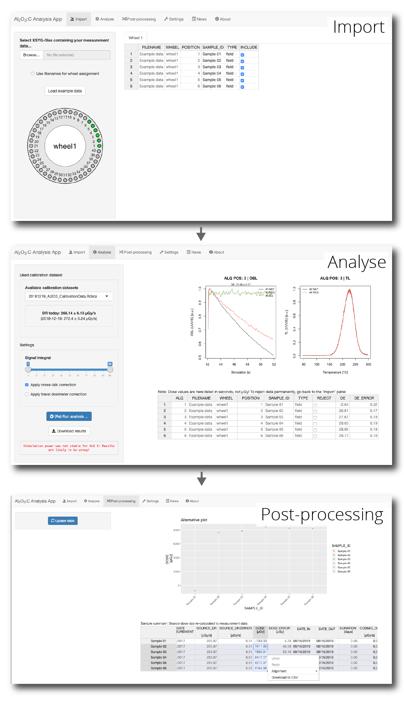

# Al2O3:C Analysis App

The 'Al2O3:C Analysis App' is a [Shiny](https://shiny.rstudio.com) application providing an exhanced graphical user interface to the function `analyse_Al2O3C_Measurement()` from the **R** package ['Luminescence'](https://CRAN.R-project.org/package=Luminescence). 

## Impressions

## Installation and usage

### Requirements

This app needs the R package ['Luminescence'](https://CRAN.R-project.org/package=Luminescence) in version 0.9.0 or newer. 

### Installation

The application can be either run local through RStudio or on a local device or an external
[Shiny Server](https://posit.co/products/open-source/shinyserver/).

## License

This program is free software: you can redistribute it and/or modify
it under the terms of the GNU General Public License as published by
the Free Software Foundation, either version 3 of the License, or
any later version.

This program is distributed in the hope that it will be useful,
but WITHOUT ANY WARRANTY; without even the implied warranty of
MERCHANTABILITY or FITNESS FOR A PARTICULAR PURPOSE.  See the
[GNU General Public License](https://github.com/RLumSK/Al2O3_AnalysisApp/blob/master/LICENSE) 
for more details.

##  Funding

The development of this application was supported by LabEx LaScArBx (ANR - n˚ ANR-10-LABX-52).
