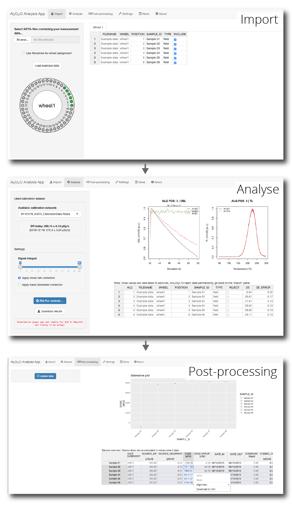

<!-- README.md is generated from README.Rmd. Please edit that file -->

# Al2O3AnalysisApp

<!-- badges: start -->

[](https://github.com/crp2a/Al2O3_AnalysisApp/actions/workflows/R-CMD-check.yaml)

[](https://crp2a.r-universe.dev)

[](https://www.repostatus.org/#active)
<!-- badges: end -->

The *Al<sub>2</sub>O<sub>3</sub>:C Analysis App* is a
[**Shiny**](https://shiny.rstudio.com) application providing an exhanced
graphical user interface to the function `analyse_Al2O3C_Measurement()`
from the [**Luminescence**](https://github.com/R-Lum/Luminescence)
package.

## Installation

You can install **Al2O3AnalysisApp** from [our
repository](https://crp2a.r-universe.dev) with:

``` r
install.packages("Al2O3AnalysisApp", repos = "https://crp2a.r-universe.dev")
```

## Usage

The application can be either run local through RStudio or on a local
device or an external [Shiny
Server](https://www.rstudio.com/products/shiny/shiny-server/).

``` r
# Load the package
library(Al2O3AnalysisApp)

# Run the app
run_app()
```



## Contributing

Please note that the **Al2O3AnalysisApp** project is released with a
[Contributor Code of
Conduct](https://github.com/crp2a/Al2O3_AnalysisApp/blob/master/.github/CODE_OF_CONDUCT.md).
By contributing to this project, you agree to abide by its terms.

## Acknowledgements

This work received a state financial support managed by the Agence
Nationale de la Recherche (France) throught the program *Investissements
d’avenir* (ref. [10-LABX-0052](https://lascarbx.labex.u-bordeaux.fr)).
